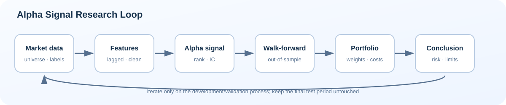

# Alpha Signal Research

## A Quantitative Strategist flagship project

This is a research-first, reproducible Alpha Signal framework for studying whether public market features can predict future cross-sectional returns and survive portfolio-level evaluation.

It is designed for:

- Quantitative Strategist interview preparation;
- research-style communication for graduate-school applications;
- repeatable comparison of signals, models, and portfolio assumptions.

It is intentionally not a live trading system, low-latency engine, or performance claim.

## Research question

> Can price and volume signals predict the next 5-trading-day cross-sectional return after time-ordered validation, portfolio construction, turnover, and transaction costs?

## Research loop

```text
Market data → Lagged features → Alpha signal → IC / quantiles
      → Walk-forward ML → Portfolio weights → Costs / risk
      → Robustness report → Research conclusion
```



## What is included

| Layer | Implementation |
|---|---|
| Signals | Momentum, reversal, volatility, liquidity |
| Baselines | Single-factor rank portfolio and equal-weight signal |
| Models | Ridge and walk-forward tree model interfaces |
| Validation | Chronological windows; optional purged/embargo extension point |
| Portfolio | Rank-based long-short weights, turnover, cost-aware returns |
| Diagnostics | IC, rank IC, quantile spread, Sharpe, volatility, drawdown |
| Reproducibility | Deterministic offline demo, tests, JSON configuration |

## Quick start

```powershell
cd 15_Alpha_Signal_Research
python -m pip install -r requirements.txt
python run_demo.py --signal momentum --output-dir reports/demo
```

The command creates:

- `reports/demo/summary.md` — concise research summary;
- `reports/demo/metrics.json` — machine-readable metrics;
- `reports/demo/performance.png` — wealth and drawdown;
- `reports/demo/information_coefficient.png` — rolling IC;
- `reports/demo/quantile_spread.png` — top-minus-bottom spread.

### Demo report preview

| Portfolio path | Predictive diagnostics | Factor spread |
|---|---|---|
| [wealth and drawdown](reports/demo/performance.png) | [rolling IC](reports/demo/information_coefficient.png) | [quantile spread](reports/demo/quantile_spread.png) |

The demo is fully offline and uses deterministic synthetic data. For real research, replace the loader with licensed point-in-time data and record its provider, adjustment rules, universe history, publication timestamps, and download date.

## Research standards

1. Features are lagged before portfolio formation.
2. Model predictions are generated only on out-of-sample dates.
3. Random train/test splitting is not used.
4. Returns are evaluated before and after turnover-based costs.
5. Robustness matters more than one attractive backtest curve.
6. The final test period must remain untouched during model selection.

## Notebook path

| Notebook | Question |
|---|---|
| [01 data & universe](notebooks/01_data_universe.ipynb) | What is the research universe and data contract? |
| [02 factor construction](notebooks/02_factor_construction.ipynb) | How are lagged signals built? |
| [03 factor analysis](notebooks/03_factor_analysis.ipynb) | Does a signal predict returns cross-sectionally? |
| [04 ML signal model](notebooks/04_ml_signal_model.ipynb) | Does ML improve the signal out of sample? |
| [05 portfolio backtest](notebooks/05_portfolio_backtest.ipynb) | Can the signal become a cost-aware portfolio? |
| [06 robustness report](notebooks/06_robustness_report.ipynb) | When does the result work or fail? |

## Interview framing

Be ready to explain the hypothesis, label timing, leakage controls, why IC is not the same as P&L, how turnover changes the conclusion, which risks remain after neutralization, and what experiment would falsify the signal.

## Scope note

The project uses a compact research package rather than a trading platform. That keeps the focus on investment reasoning, empirical validation, portfolio decisions, and clear communication—the core of a strategy-oriented QS portfolio.
