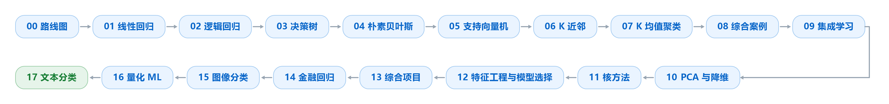

# 机器学习原理

> Machine Learning From First Principles · 从零推导与动手实现的 ML Notebook 系列


一套从零推导经典机器学习算法的系列 Notebook：每个章节一个独立 notebook，先讲原理，再手写实现，最后与成熟库（scikit-learn / XGBoost）对照验证；并配有可直接运行的数据与实战案例。

## 项目特点

- **从零推导**：算法背后的数学原理逐步展开，不跳步
- **手写实现 + 库对照**：每个模型先用 NumPy 手写，再与 scikit-learn / XGBoost 结果对比
- **开箱即用**：数据随仓库提供（小数据入库，Fashion-MNIST 提供下载脚本），克隆后即可运行
- **量化金融实战**：含 BTC 收益率回归、量化因子建模、信用卡违约分类等金融场景案例

## 学习路径



进度：18 / 18 完成 ✅

## 章节总览

| # | 章节 | 主题 | 状态 |
|---|------|------|------|
| 00 | 机器学习模型路线图 | 学习路径与总览 | ✅ |
| 01 | 线性回归 | 最小二乘 / 梯度下降 / 正则化 | ✅ |
| 02 | 逻辑回归 | Sigmoid / 交叉熵 / 分类边界 | ✅ |
| 03 | 决策树 | 信息增益 / 基尼系数 / 剪枝 | ✅ |
| 04 | 朴素贝叶斯 | 贝叶斯定理 / 拉普拉斯平滑 | ✅ |
| 05 | 支持向量机 | 最大间隔 / 对偶问题 / 核技巧 | ✅ |
| 06 | K 近邻 | 距离度量 / K 值选择 / 交叉验证 | ✅ |
| 07 | K 均值聚类 | K-Means / 肘部法则 | ✅ |
| 08 | 综合案例 | 信用卡违约分类（含数据） | ✅ |
| 09 | 集成学习 | Bagging / 随机森林 / Boosting | ✅ |
| 10 | PCA 与降维 | 主成分分析 / 方差解释率 | ✅ |
| 11 | 核方法 | 核函数 / SVM 扩展 | ✅ |
| 12 | 特征工程与模型选择 | 特征处理 / 网格搜索 / 模型对比 | ✅ |
| 13 | 综合项目 | 全模型横向对比实战 | ✅ |
| 14 | 金融回归 | BTC 收益率回归（含数据） | ✅ |
| 15 | 图像分类 | Fashion-MNIST 图像分类（含数据） | ✅ |
| 16 | 量化 ML | 量化因子与 ML 建模（含数据） | ✅ |
| 17 | 文本分类 | 文本向量化与分类（含数据） | ✅ |

## 快速开始

```bash
git clone https://github.com/Aayloo/ML.git
cd ML
pip install -r requirements.txt
jupyter notebook
```

- 建议 Python 3.10+
- 第 15 章（图像分类）需要先获取 Fashion-MNIST 数据：
- 第 17 章（文本分类）的数据会在运行时自动从公开地址下载：

```bash
python scripts/download_fashion_mnist.py
```

notebook 已保存运行结果，可直接在 GitHub 上浏览；本地重新运行即可复现。

## 数据说明

| 章节 | 数据 | 大小 | 入库策略 |
|------|------|------|----------|
| 08 | 信用卡违约样本 | 2.8 MB | ✅ 入库 |
| 14 | BTC 价格数据 | 2.4 MB | ✅ 入库 |
| 15 | Fashion-MNIST | 29.4 MB | ⬜ 不入库 · 运行 `python scripts/download_fashion_mnist.py` 获取 |
| 16 | 量化因子数据 | 0.8 MB | ✅ 入库 |
| 17 | 短信分类语料 | 0.5 MB | ⬜ 不入库 · 由 notebook 自动下载 |

## 数据来源

| 章节 | 数据集 | 来源 | 许可 |
|------|--------|------|------|
| 08 | Default of Credit Card Clients | UCI Machine Learning Repository | CC BY 4.0 |
| 14 | BTC 历史价格 | Coin Metrics（公开数据） | 公开 |
| 15 | Fashion-MNIST | zalandoresearch/fashion-mnist | MIT |
| 16 | 股票价格数据 | QuantConnect/Lean（GitHub 官方仓库） | 见 Lean 仓库 |
| 17 | SMS Spam Collection | UCI（经 pycon-2016-tutorial 整理） | 公开 |

> 08 章的本地 CSV 由官方 XLS 机械转换，转换细节与校验见 `08_综合案例/data/SOURCE.md`。

## 目录结构

```text
ML/
├── README.md
├── requirements.txt
├── .gitignore
├── 00_机器学习模型路线图.ipynb
├── 01_线性回归/01_linear_regression.ipynb
├── ...
└── 17_文本分类/17_text_classification.ipynb
```

## 许可

MIT License · © 2026 Aayloo
