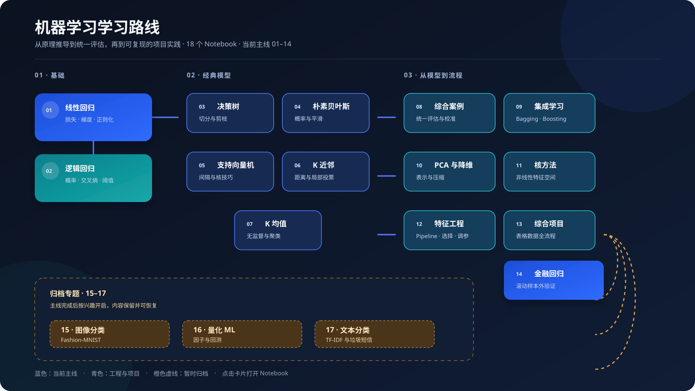

# 机器学习原理 · From First Principles

> 用 NumPy 手写经典算法，再用 scikit-learn / XGBoost 对照验证；从公式、直觉到项目，把机器学习真正跑通。

[](https://www.python.org/)
[](https://jupyter.org/)
[](LICENSE)

## 先看路线图

[](docs/learning-roadmap.md)

这不是按模型名称堆起来的代码目录，而是一条从“损失函数与梯度”走到“数据切分、模型比较和误差分析”的学习路径。

- [打开完整学习路线](docs/learning-roadmap.md)
- [阅读 ML 实验质量规范](docs/ml-quality-checklist.md)
- [打开详细路线 Notebook](00_机器学习模型路线图.ipynb)

## 你将学到什么

| 阶段 | 章节 | 能力目标 |
|---|---|---|
| 基础 | 01–02 | 用损失函数、梯度下降和概率模型完成回归/分类闭环 |
| 经典模型 | 03–07 | 比较树、概率、间隔、实例和聚类五种归纳偏置 |
| 统一评估 | 08–09 | 使用 baseline、Pipeline、交叉验证和集成学习 |
| 表示与工程 | 10–13 | 理解降维、核方法、特征工程和模型选择 |
| 时间序列 | 14 | 使用滚动样本外验证，识别未来信息和回测偏差 |
| 归档专题 | 15–17 | 按兴趣扩展到图像、量化和文本数据 |

## 当前主线 · 01–14

仓库共包含 **18 个 Notebook（00–17）**：`00` 是详细学习指南，`01–17` 是 17 个课程/项目章节。为了让首页更聚焦，当前公开主线先突出 `01–14`。

| # | 章节 | 核心主题 | Notebook |
|---:|---|---|---|
| 01 | 线性回归 | 最小二乘、梯度下降、正则化 | [打开](01_线性回归/01_linear_regression.ipynb) |
| 02 | 逻辑回归 | Sigmoid、交叉熵、分类边界 | [打开](02_逻辑回归/02_logistic_regression.ipynb) |
| 03 | 决策树 | 信息增益、基尼系数、剪枝 | [打开](03_决策树/03_decision_tree.ipynb) |
| 04 | 朴素贝叶斯 | 贝叶斯定理、条件独立、平滑 | [打开](04_朴素贝叶斯/04_naive_bayes.ipynb) |
| 05 | 支持向量机 | 最大间隔、对偶问题、核技巧 | [打开](05_支持向量机/05_svm.ipynb) |
| 06 | K 近邻 | 距离度量、K 值选择、尺度 | [打开](06_K近邻/06_knn.ipynb) |
| 07 | K 均值聚类 | 质心更新、肘部法、轮廓系数 | [打开](07_K均值聚类/07_kmeans.ipynb) |
| 08 | 综合案例 | 信用卡违约、阈值、校准、PR-AUC | [打开](08_综合案例/08_credit_card_default_ml.ipynb) |
| 09 | 集成学习 | Bagging、随机森林、GBDT、XGBoost | [打开](09_集成学习/09_ensemble.ipynb) |
| 10 | PCA 与降维 | 投影、方差解释率、压缩 | [打开](10_PCA与降维/10_pca.ipynb) |
| 11 | 核方法 | 核函数、核岭回归、核 PCA | [打开](11_核方法/11_kernel_methods.ipynb) |
| 12 | 特征工程与模型选择 | 编码、缩放、特征选择、调参 | [打开](12_特征工程与模型选择/12_feature_engineering.ipynb) |
| 13 | 综合项目 | 表格数据全流程横向比较 | [打开](13_综合项目/13_ml_all_models.ipynb) |
| 14 | 金融回归 | 未来收益/波动率与滚动验证 | [打开](14_金融回归/14_btc_return_regression.ipynb) |

## 归档专题 · 15–17

这些内容没有删除，只是暂时移到 `archive/`，避免首页过长。完成主线后可以继续学习：

- [15 图像分类](archive/15_图像分类/15_fashion_mnist.ipynb)：Fashion-MNIST、高维像素和错误分析。
- [16 量化 ML](archive/16_量化ML/16_quant_ml_factor.ipynb)：横截面因子、样本外预测和回测。
- [17 文本分类](archive/17_文本分类/17_text_classification.ipynb)：TF-IDF、稀疏特征和垃圾短信识别。

## 快速开始

建议使用 Python 3.10+ 和虚拟环境：

```bash
git clone https://github.com/Aayloo/ML.git
cd ML
python -m venv .venv

# macOS / Linux
source .venv/bin/activate

# Windows PowerShell
# .venv\Scripts\Activate.ps1

python -m pip install --upgrade pip
pip install -r requirements.txt
jupyter lab
```

第 15 章需要 Fashion-MNIST 数据；归档后仍可在对应目录运行：

```bash
python scripts/download_fashion_mnist.py
```

## 数据与许可

仓库内的教学数据尽量提供本地副本或下载脚本，便于离线复现。第三方数据的许可和来源以各章节说明为准：

| 章节 | 数据 | 来源 |
|---:|---|---|
| 08 | Default of Credit Card Clients | [UCI Machine Learning Repository](https://archive.ics.uci.edu/dataset/350/default+of+credit+card+clients)，CC BY 4.0 |
| 13 | Iris | [seaborn-data](https://github.com/mwaskom/seaborn-data) |
| 14 | BTC 历史价格 | [Coin Metrics data](https://github.com/coinmetrics/data) |
| 15 | Fashion-MNIST | [zalandoresearch/fashion-mnist](https://github.com/zalandoresearch/fashion-mnist) |
| 16 | 股票价格样例 | [QuantConnect/Lean](https://github.com/QuantConnect/Lean) |
| 17 | SMS Spam Collection | [UCI / pycon-2016-tutorial](https://github.com/justmarkham/pycon-2016-tutorial) |

## 实验标准与边界

本项目是面向学习的可复现实验，不是生产模型或投资建议。每章尽量遵循：

1. 先跑 baseline，再比较复杂模型是否真正带来增益；
2. 预处理、特征选择和调参只在训练边界内拟合；
3. 普通数据使用分层交叉验证，时间序列使用滚动样本外验证；
4. 同时看指标、误差样本、稳定性、数据来源和适用边界。

完整规范见 [ML 实验质量规范](docs/ml-quality-checklist.md)。

## 关于 GitHub 页面中的提交说明

`Initial commit: 机器学习原理 17 章 Notebook 系列` 是整套目录第一次批量上传时使用的提交标题。GitHub 在目录列表中显示该目录最近一次被修改的提交标题，所以多个目录会显示相同的 `Initial commit`。

`docs: 优化对外文案...` 中的 `docs` 是 Conventional Commits 的类型，表示“这次提交主要修改文档”，不是一个目录，也不会影响项目运行。后续真实修改会使用 `docs:`、`fix:`、`chore:` 等更具体的提交说明。

## 许可

本项目采用 [MIT License](LICENSE)。欢迎通过 Issue 反馈错误、补充案例或提出学习建议。

## Quantitative Strategist Flagship Project

The learning repository is complemented by the separate [Alpha Signal Research](https://github.com/Aayloo/Alpha-Signal-Research) flagship project for Quantitative Strategist preparation: Momentum, Reversal, Volatility, and Liquidity signals with walk-forward ML, portfolio construction, transaction costs, risk metrics, and research reports.
