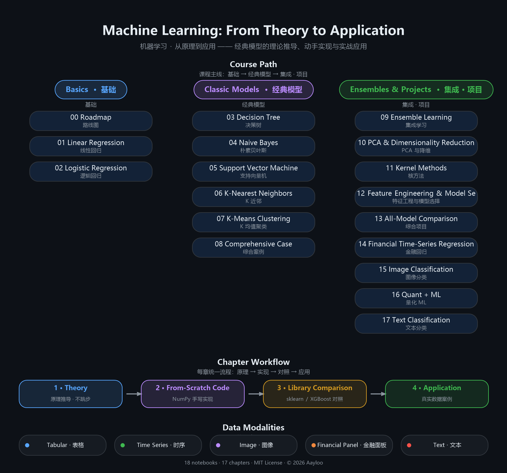

# Machine Learning: From Theory to Application

> 机器学习 · 从原理到应用 —— Jupyter Notebooks that take classic ML models from mathematical principles and from-scratch implementations to simple, practical applications.


A Jupyter Notebook series covering classic machine learning models: each chapter derives the theory, implements the model from scratch in NumPy, compares it with mature libraries (scikit-learn / XGBoost), and applies it to a real dataset. Datasets are included (or auto-downloaded), so everything runs out of the box.

## Course Overview



## How Each Chapter Works

Theory → From-scratch implementation → Library comparison → Real-world application

## Table of Contents

| # | Chapter | Topic | Status |
|---|---------|-------|--------|
| 00 | Machine Learning Roadmap | Learning path & overview | ✅ |
| 01 | Linear Regression | Least squares / gradient descent / regularization | ✅ |
| 02 | Logistic Regression | Sigmoid / cross-entropy / decision boundary | ✅ |
| 03 | Decision Tree | Information gain / Gini / pruning | ✅ |
| 04 | Naive Bayes | Bayes' theorem / Laplace smoothing | ✅ |
| 05 | Support Vector Machine | Max margin / dual problem / kernel trick | ✅ |
| 06 | K-Nearest Neighbors | Distance metrics / K selection / cross-validation | ✅ |
| 07 | K-Means Clustering | K-Means / elbow method | ✅ |
| 08 | Comprehensive Case | Credit-card default classification (with data) | ✅ |
| 09 | Ensemble Learning | Bagging / Random Forest / Boosting | ✅ |
| 10 | PCA & Dimensionality Reduction | Principal component analysis / explained variance | ✅ |
| 11 | Kernel Methods | Kernel functions / SVM extensions | ✅ |
| 12 | Feature Engineering & Model Selection | Feature processing / grid search / model comparison | ✅ |
| 13 | Comprehensive Project | All-model benchmark | ✅ |
| 14 | Financial Regression | BTC return regression (with data) | ✅ |
| 15 | Image Classification | Fashion-MNIST image classification (with data) | ✅ |
| 16 | Quant ML | Factor modeling with ML (with data) | ✅ |
| 17 | Text Classification | Text vectorization & classification (with data) | ✅ |

## Quick Start

```bash
git clone https://github.com/Aayloo/ML.git
cd ML
pip install -r requirements.txt
jupyter notebook
```

- Python 3.10+ recommended
- Chapter 15 (image classification) needs the Fashion-MNIST dataset first:

```bash
python scripts/download_fashion_mnist.py
```

- Chapter 17 downloads its dataset automatically on first run.

## Data

| Chapter | Data | Size | In repo |
|---------|------|------|---------|
| 08 | Credit-card default samples | 2.8 MB | ✅ Yes |
| 14 | BTC price data | 2.4 MB | ✅ Yes |
| 15 | Fashion-MNIST | 29.4 MB | ❌ No · run `python scripts/download_fashion_mnist.py` |
| 16 | Factor data | 0.8 MB | ✅ Yes |
| 17 | SMS spam corpus | 0.5 MB | ❌ No · auto-downloaded at runtime |

## Data Sources

| Chapter | Dataset | Source | License |
|---------|---------|--------|---------|
| 08 | Default of Credit Card Clients | UCI Machine Learning Repository | CC BY 4.0 |
| 14 | BTC historical prices | Coin Metrics | Public |
| 15 | Fashion-MNIST | zalandoresearch/fashion-mnist | MIT |
| 16 | US equity daily data | QuantConnect/Lean | See Lean repo |
| 17 | SMS Spam Collection | UCI (cleaned by pycon-2016-tutorial) | Public |

> The local CSV in chapter 08 is a mechanical conversion of the official XLS; conversion details and validation are documented in `08_综合案例/data/SOURCE.md`.

## Repository Structure

```text
ML/
├── README.md
├── requirements.txt
├── .gitignore
├── docs/overview.png
├── 00_机器学习模型路线图.ipynb
├── 01_线性回归/01_linear_regression.ipynb
├── ...
└── 17_文本分类/17_text_classification.ipynb
```

## License

MIT License · © 2026 Aayloo
