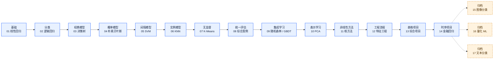

# 机器学习学习路线

> 用一条主线掌握经典 ML：先建立数据与损失函数的直觉，再比较不同归纳偏置，最后把方法放入统一的评估流程。

[返回仓库首页](../README.md) · [查看项目规范](ml-quality-checklist.md) · [打开详细路线 Notebook](../00_机器学习模型路线图.ipynb)

## 一图总览

下图是当前 GitHub 首页使用的静态版本；节点可点击。`01–14` 是当前主线，`15–17` 暂时移入归档区，内容仍然保留。

## 按目标选择路径

| 你的目标 | 建议路径 | 重点产出 |
|---|---|---|
| 建立算法直觉 | 01 → 02 → 03 → 04 → 05 → 06 | 能解释损失、边界、距离、概率和间隔 |
| 做表格数据建模 | 01 → 02 → 03 → 08 → 09 → 12 → 13 | 能建立 baseline、Pipeline、交叉验证和错误分析 |
| 做无监督探索 | 07 → 10 → 11 → 13 | 能区分聚类、降维和可视化的目标 |
| 做时间序列研究 | 12 → 14 | 能使用滚动样本外验证，避免随机切分和未来信息 |
| 继续扩展专项 | 14 → 归档 15 / 16 / 17 | 图像、量化和文本作为专题分支学习 |

## 当前主线章节

| 顺序 | 章节 | 学习问题 | 通过标准 |
|---:|---|---|---|
| 01 | [线性回归](../01_线性回归/01_linear_regression.ipynb) | 如何用损失函数学习连续值？ | 能解释最小二乘、梯度下降和 R²。 |
| 02 | [逻辑回归](../02_逻辑回归/02_logistic_regression.ipynb) | 如何把线性输出变成概率？ | 能解释 Sigmoid、交叉熵、阈值和 ROC-AUC。 |
| 03 | [决策树](../03_决策树/03_decision_tree.ipynb) | 如何递归地切分特征空间？ | 能比较熵、基尼系数、深度和过拟合。 |
| 04 | [朴素贝叶斯](../04_朴素贝叶斯/04_naive_bayes.ipynb) | 如何用条件概率分类？ | 能说明独立性假设和拉普拉斯平滑。 |
| 05 | [支持向量机](../05_支持向量机/05_svm.ipynb) | 如何最大化分类间隔？ | 能解释对偶、核技巧和 C 的作用。 |
| 06 | [K 近邻](../06_K近邻/06_knn.ipynb) | 如何用邻居做预测？ | 能说明尺度、K 值和维数灾难。 |
| 07 | [K 均值聚类](../07_K均值聚类/07_kmeans.ipynb) | 没有标签时如何发现结构？ | 能使用肘部法和轮廓系数，并说明聚类边界。 |
| 08 | [综合案例](../08_综合案例/08_credit_card_default_ml.ipynb) | 如何统一比较多个分类模型？ | 能报告 baseline、分层 CV、PR-AUC、阈值和校准。 |
| 09 | [集成学习](../09_集成学习/09_ensemble.ipynb) | 如何降低方差或偏差？ | 能区分 Bagging、随机森林、GBDT 和 XGBoost。 |
| 10 | [PCA 与降维](../10_PCA与降维/10_pca.ipynb) | 如何压缩冗余特征？ | 能解释方差解释率和训练集拟合边界。 |
| 11 | [核方法](../11_核方法/11_kernel_methods.ipynb) | 如何在隐式高维空间建模？ | 能联系核函数、核岭回归、核 PCA 和 SVM。 |
| 12 | [特征工程与模型选择](../12_特征工程与模型选择/12_feature_engineering.ipynb) | 如何把数据处理成可泛化的流程？ | 能使用 Pipeline、交叉验证和防泄漏特征选择。 |
| 13 | [综合项目](../13_综合项目/13_ml_all_models.ipynb) | 如何横向比较多类模型？ | 能分别报告探索性结果和独立测试集结果。 |
| 14 | [金融回归](../14_金融回归/14_btc_return_regression.ipynb) | 如何在时间顺序下验证模型？ | 能使用滚动样本外评估，并解释收益与波动率差异。 |

## 归档专题

归档代表“暂时不放在主线首页”，不是删除或否定内容。它们适合完成 01–14 后按兴趣打开。

- [15 图像分类](../archive/15_图像分类/15_fashion_mnist.ipynb)：高维像素、PCA 与 Fashion-MNIST。
- [16 量化 ML](../archive/16_量化ML/16_quant_ml_factor.ipynb)：横截面因子、滚动样本外预测与回测。
- [17 文本分类](../archive/17_文本分类/17_text_classification.ipynb)：TF-IDF、稀疏特征与垃圾短信识别。

## 学习原则

1. 先跑最简单的 baseline，再讨论复杂模型是否真的带来增益。
2. 预处理、特征选择和调参都必须放进交叉验证或 Pipeline 的训练边界内。
3. 时间序列按时间滚动验证；最终测试区间不参与模型选择。
4. 结果不仅看一个分数，还要看误差样本、类别代价、稳定性和数据来源。

